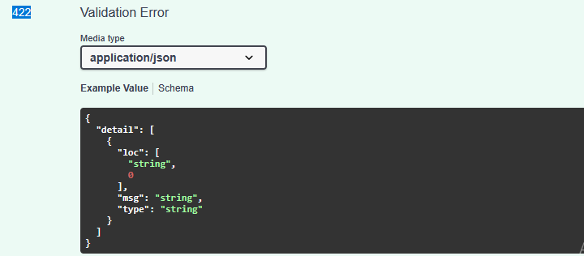
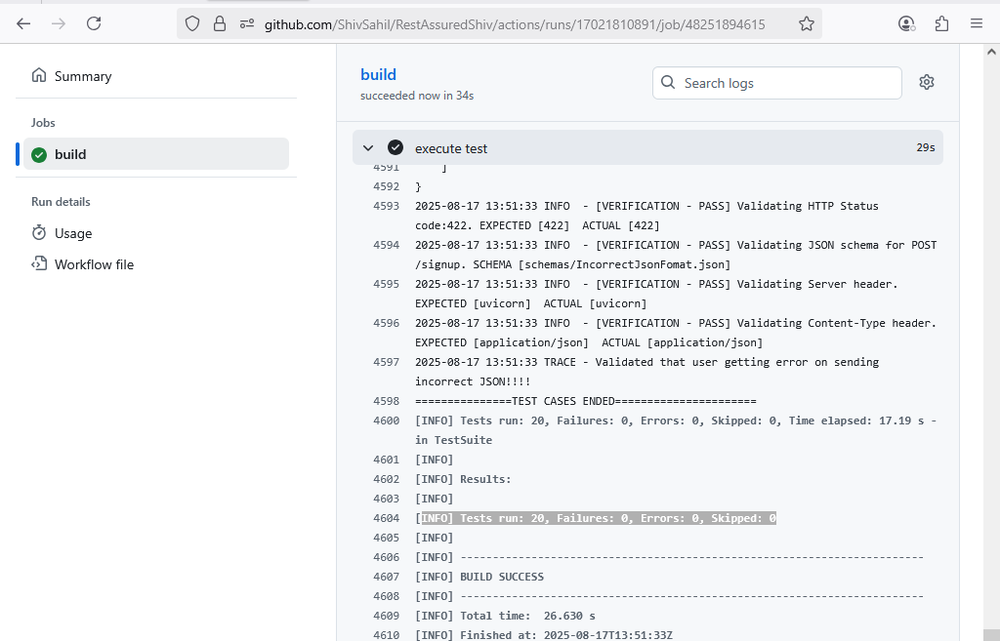

RestAssured Framework for testing Book API (By Shiv Sahil Guleri)

## How to Run the Tests

### Prerequisites

- Maven 3.8.4+
- Java 17+
- Git
- Any IDE (e.g., IntelliJ IDEA, Eclipse, VS Code)
- Run Book Store API on local machine after reading the Book API's own README.md file

### Steps to Execute

1. Clone the repository:
   ```bash
   git clone https://github.com/your-username/bookapi-tests.git
   cd RestAssuredShiv
2. set env as QA in config file using, env=QA
3. Run the Scenarios
   ```bash
   mvn clean test
4.  Reports are generated with a time stamped named for easy identification
   cd RestAssuredShiv/report

## Sample Report
**[Download Sample Report](readMeScreenshot/sampleReport.html)**

## Validation Covered
Validation is handled through the *WrappedAssert* class, which extends TestNG’s built-in assertions with Log4j and ExtentReports integration.

1. Header and body validations are covered within the test cases.
2. Schema validation is built into the *ApiClient* class.
3. Status code validation is also built into the *ApiClient* class.
4. Negative test cases are included as well.


## Project Structure Implementation Details

- Each API request is mapped to a corresponding **test class** with the same name.  
  Example: *Get All Books* request is tested in **`GetAllBooksTest.java`**.

- A single test class can contain **multiple test cases**.

- **POJO classes** are used for serialization and deserialization of request and response bodies.

#### Request Chaining
- The token generated from a **login request** is reused across subsequent requests.  
- Newly created **username and password** are also reused in other requests.  
- **`dependsOnGroups`** and **`dependsOnMethods`** annotations ensure proper test execution order.

#### Logging
- Test cases use **`WrappedReportLogger`** for logging.  
- Logs are displayed on the **console** and also captured in the **Extent Report**.

#### ApiClient
- Handles sending HTTP requests: `GET`, `POST`, `PUT`, `DELETE`.  
- Validates responses against:
  - **Status codes**  
  - **JSON schemas**  
- Internally uses **`WrappedAssert`** for assertions.

#### RequestBuilder
- Provides reusable request specifications.  
- Supports different combinations such as:
  - With Auth Token  
  - With Body (without Auth Token)  
- Accepts **path parameters** and **query parameters**.

#### Data-Driven Testing
- Implemented using **`@DataProvider`** to supply multiple input sets for test cases.

#### Assertions
- Standard assertions: `assertEquals`, `assertNotNull`, `assertTrue`.  
- Schema validation (`assertJsonSchema`) and status code checks are built into **`ApiClient`**.

#### Schema Management
- JSON Schemas for expected responses are stored in a **dedicated folder** for better organization.

#### EnvConfigResolver
- The **`EnvConfigResolver`** class dynamically resolves environment-specific configurations:
  - `URL`  
  - `Email`  
  - `Password`  
- Supported environments: **QA**, **DEV**, **PROD**.


## Testing Strategy 
- request chaining was done for shairing token, new email, new pwd.

- `**POSTIVE WORKFLOW** health Check up>> creation of new user >> login to get access token >> get all books >> create new Book >> Validating of new book is displayed in the list of all the books >> getting newly created book by ID >> update newly added book >> check this newly added book in list of all the book >> Delete newly added book`

- `**NEGATIVE TESTCASES** Validating creation of new user with existing email, Login using incorrect _SET OF_ credentails, Validating if books are not displayed when invalid token used, Validating if books are not displayed when NO token used, Validating user unable to search a book with incorrect ID, try to twice delete a book, unable to search deleted book, Incorrectly formatted JSON file validation, validating using expired and incorrect token`
- POJO classes used for searlization and desearlization
- in each testcases Logging was done. this outputed details on Console and report
- Negative testcases are covered.
- validation of Body, header, status code, schema is also covered.
- @DataProvider is to supply multiple input sets for test cases.
-  environment-specific configurations like URL, email and password are resolved dynamically
-  yml file for **gitHub action** has already been added

## List of issues
-  I am  unable to create *Invalid JSON Request Body** which could give us 422 status using POJO classs .
  
   Instead of relying on serialization, I build the string manually.
- When incorrect credentials are provided during login, the server responds with a 400 Bad Request instead of a 401 Unauthorized.
- During the login request validation, I found that the request is processed regardless of the provided user ID.
- If a user tries to retrieve all books with an incorrect token, they receive a 403 Forbidden error instead of a 401 Unauthorized.
- When attempting to add a new book with an existing ID, the server returns a 500 Internal Server Error, indicating it cannot handle duplicate IDs.
- There is currently no functionality to delete users, making test data cleanup impossible.
- since API provided to me was on local machine. I hosted it on my local machine using "ssh -R 80:127.0.0.1:8000 serveo.net". after that I added the temporary URL to my config file.
Whenever I am pushing my code to gitHub, execution is trigerring automtically on **github actions**. Although this is not correct CI pipeline. A correct CI pipeline, starts executing when someone checks in code to Dev repo and not to QA repo.
 


## FrameWork structure
```
src/main/java/
└── com/bookapi/
    ├── assertions/
    │   └── WrappedAssert.java          #  TestNG’s built-in assertion capabilities by wrapping them with Log4j + extent repor
    │
    │── endPoints/
    │   └── EndPoints.java              # holds all API endpoint paths as constants for easy reuse and maintainability.
    │
    ├── logs/
    │   ├── ConsoleColors.java          # #provides colored console output for better readability
    │   └── WrappedReportLogger.java    # wraps Log4j + ExtentReports to log messages with console colors and reporting integration
    │
    ├── pojo/
    │   ├── request/                    # Request POJO classes
    │   └── response/                   # Response POJO classes
    │
    ├── report/
    │   └── ExtentFactory.java          # ExtentReports setup by integrating with ITestListener to generate HTML test report
    │
    └── reportBuilder/                  
    │   └── ApiClient.java              # sends HTTP requests and validates responses against expected status codes and JSON schemas.
    │   └── RequestBuilder.java         # reusable RestAssured request specifications with optional auth, body, and parameters.
    │
    │── utils/
    │   └── ConfigurationManager.java   # access config.properties file
    │   └── DataGenerator.java          # provides utility methods to generate random test data such as email, ID, password, and year.
    │   └── EnvConfigResolver.java      # dynamically loads environment-specific configuration based on the selected environment
    │

src/main/resources/
└── schemas/                            # contains all the response schemas which are used ApiClient.java for validation
└── log4j2.xml                          # log4j file


src/test/java/
└── com/bookapi/testcases/
    ├── assertions/                     # All the testcases are written here

config.properties                       
pom.xml                                     
testng.xml


## All the tools used

- Maven 3.8.4+
- Java 17+
- Git
- Any IDE (e.g., IntelliJ IDEA, Eclipse, VS Code)
- RestAssured
- TestNG
- log4j2
- ExtentReports
- GitHub Actions: CI/CD pipeline for automated testing and deployment


